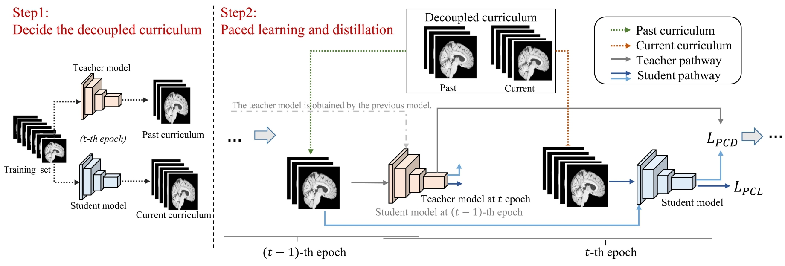

# 🧠 Advancing Brain Imaging Analysis Step-by-step via Progressive Self-paced Learning


> **Overview**:The architecture of the proposed PSPD, where the teacher model is derived from the models trained at previous epochs. We first establish a decoupled curriculum setting that considers both the current and past states of the model, and then train the model based on this setting for learning and distillation.

The method is trained and evaluated on:

- [ADNI](https://ida.loni.usc.edu/)

---

## 🛠️ Setup

### 🔄 Preprocessing

All MRI images should be preprocessed and z-score normalized.

> 🔧 **Preprocessing code is in preparation.**  
> We recommend the normalization using: https://github.com/jcreinhold/intensity-normalization

### 📦 Requirements

```
apex  
transformations  
pytorch  
numpy  
logging  
nibabel  
sklearn  
```

Install apex using source code: [https://github.com/NVIDIA/apex](https://github.com/NVIDIA/apex)  
Others can be installed by pip or conda.

---

## 🚀 Run

```shell
CUDA_VISIBLE_DEVICES=0 python -m torch.distributed.launch \
                        --nproc_per_node=1 \
                        --master_port 51321 \
                        PSPD.py 
```

---

## 📄 Cite

```bibtex
@inproceedings{yang2024advancing,
  title={Advancing Brain Imaging Analysis Step-by-Step via Progressive Self-paced Learning},
  author={Yang, Yanwu and Chen, Hairui and Hu, Jiesi and Guo, Xutao and Ma, Ting},
  booktitle={International Conference on Medical Image Computing and Computer-Assisted Intervention},
  pages={58--68},
  year={2024},
  organization={Springer}
}
```
